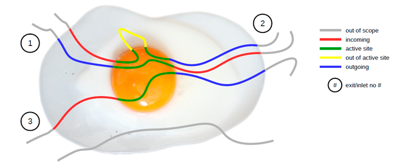

How does AQUA-DUCT work
-----------------------

AQUA-DUCT is a tool perfectly capable of tracing molecules that enter defined region of the macromolecule during MD simulation. Detailed statistics and visualization of all traced molecules are available. Moreover, AQUA-DUCT performs clustering of exits/inlets data and groups identified paths according to this clusters - inlet-exit event grouping.

Following picture illustrates the concept behind AQUA-DUCT. Molecules which flow through the active site are traced. Incoming, outgoing, and active site parts of paths are detected and visualized accordingly. Traced molecules form clusters which allow for further detailed analysis of the flow.
Optionally, AQ can trace molecules which does not flow through the active site. This can be useful to ilustrate overall flow and can be also used to derive relative number of molecules visiting the active site.

AQUA-DUCT performs calculations in 6 stages:

#. Traceable residues
#. Raw paths
#. Separate paths
#. Clustering of inlets
#. Analysis
#. Visualization

Following sections briefly explain these stages, detailed description can be found in the AQ documentation.

Traceable residues
^^^^^^^^^^^^^^^^^^

In the first stage of calculation AQ finds all residues that should be traced and appends them to the list of *traceable residues*. It is done in a loop over all frames. In each frame residues of interest are searched and appended to the list but only if they are not already present on the list. In *sandwich* mode this is repeated for each layer.

The search of the residues is done according to user provided definitions. Two requirements have to be met to append residue to the list:

#. The residue has to be found according to the *Object* definition.
#. The residue has to be within the *Scope* of interest.

The *Object* definition encompasses usually the active site of the protein. The *Scope* of interest defines, on the other hand, the boundaries in which residues are traced and is usually defined as protein.

Since AQUA-DUCT in its current version uses `MDAnalysis <http://www.mdanalysis.org/>`_ Python module for reading, parsing and searching of MD trajectory data, definitions of *Object* and *Scope* have to be given as its *Selection Commands*.

Object definition
"""""""""""""""""

*Object* definition has to comprise of two elements:

#. It has to define residues to trace.
#. It has to define spatial boundaries of the *Object* site.

For example, proper Object definition could be following::

    (resname WAT) and (sphzone 6.0 (resnum 99 or resnum 147))

It defines ``WAT`` as residues that should be traced and defines spatial constrains of the *Object* site as spherical zone within 6 Angstroms of the center of masses of residues with number 99 and 147.

Scope definition
""""""""""""""""

*Scope* can be defined in two ways: as *Object* but with broader boundaries or as the convex hull of selected molecular object.

In the first case definition is very similar to *Object* and it has to follow the same limitations. For example, proper *Scope* definition could be following::

    resname WAT around 2.0 protein

It consequently has to define ``WAT`` as residues of interest and defines spatial constrains: all ``WAT`` residues that are within 2 Angstroms of the protein.

If the *Scope* is defined as the convex hull of selected molecular object (which is **recommended**), the definition itself have to comprise of this molecular object only, for example ``protein``. In that case the scope is interpreted as the interior of the convex hull of atoms from the definition. Therefore, *traceable residues* would be in the scope only if they are within the convex hull of atoms of ``protein``.

Raw paths
^^^^^^^^^

The second stage of calculations uses the list of all traceable residues from the first stage and finds coordinates of center of masses for each residue in each frame. As in the first stage, it is done in a loop over all frames. For each residue in each frame AQUA-DUCT calculates or checks two things:

#. Is the residue in the *Scope* (this is always calculated according to the Scope definition).
#. Is the residue in the *Object*. This information is partially calculated in the first stage and can be reused in the second. However, it is also possible to recalculate this data according to the new *Object* definition.

For each of the *traceable residues* a special *Path* object is created which stores frames in which a residue is in *scope* or in *object*.

Separate paths
^^^^^^^^^^^^^^

The third stage uses collection of *Path* objects to create *Separate Path* objects. Each *Path* comprise data for one residue. It may happen that the residue enters and leaves the *Scope* and the *Object* many times over the entire MD. Each such an event is considered by AQUA-DUCT as a separate path.

There are two types of *Separate Paths*:

* *Object Paths*
* *Passing Paths*

*Object Paths* are traces of molecules that visited *Object* area. *Passing Paths* are traces of molecules that entered *Scope* but did not entered *Object* area.

*Passing paths* comprises of one part only.
Each *object path* comprises of three parts:

#. *Incoming* - Defined as a path that leads from the point in which residue enters the *Scope* and enters the object for the firs time.
#. *Object* - Defined as a path that leads from the point in which residue enters the *Object* for the first time and leaves it for the last time.
#. *Outgoing* - Defined as a path that leads from the point in which residue leaves the *Object* for the last lime and leaves the *Scope*.

It is also possible that incoming and/or outgoing part of the separate path is empty.

After the initial search of *Separate Path* objects it is possible to run special procedure, Auto Barber, which trims paths down to the approximated surface of the macromolecule or other molecular entity defined by the user.

Separate paths can be optionally smoothed for visualization purposes. AQUA-DUCT implements several smoothing methods, including Savitzky-Golay filter.

Clustering of inlets
^^^^^^^^^^^^^^^^^^^^^^^^

Each of the separate paths has beginning and end. If they are at the boundaries of the *Scope* they are considered as *Inlets*, i.e. points that mark where the *traceable residues* enters or leaves the *Scope*. Clusters of inlets, on the other hand, mark endings of tunnels or ways in the system which was simulated in the MD.

Clustering of inlets is performed in following steps:

#. `Initial clustering`: All inlets are submitted to selected clustering method and depending on the method and settings, some of the inlets might not be arranged to any cluster and are considered as outliers.
#. [Optional] `Outliers detection`: Arrangement of inlets to clusters is sometimes far from optimal. In this step, *inlets* that do not fit to cluster are detected and annotated as outliers. This step can be executed in two modes:

    #. `Automatic mode`: Inlet is considered to be an outlier if its distance from the centroid is greater then mean distance + 4 * standard deviation of all distances within the cluster.
    #. `Defined threshold`: Inlet is considered to be an outlier if its minimal distance from any other point in the cluster is greater then the threshold.

#. [Optional] `Reclustering of outliers`: It may happen that the outliers form actually clusters but it was not recognized in initial clustering. In this step clustering is executed for outliers only and found clusters are appended to the clusters identified in the first step. Rest of the inlets are marked as outliers.

At the end of clustering stage it is possible to run procedure for `master path` generation. First, separate paths are grouped according to clusters. Paths that begin and end in particular clusters are grouped together. Next, for each group a `master path` (i.e., average path) is generated.

Analysis
^^^^^^^^

Fifth stage of AQUA-DUCT calculations analyses results calculated in stages 1 to 4. Results of the analysis are displayed on the screen or can be save to text file. Detailed description of analysis result file can be found in the AQ documentation.

Visualization
^^^^^^^^^^^^^

Sixth stage of AQUA-DUCT calculations visualizes results calculated in stages 1 to 4. Visualization is done with PyMOL. AQUA-DUCT automatically starts PyMOL and loads visualizations in to it.
Molecule is loaded as PDB file. Other objects like Inlets clusters or paths are loaded as CGO objects.
