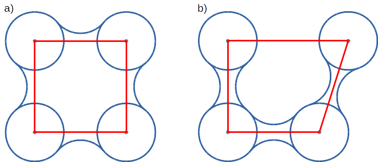

*Valve* manual
==============

*Valve* application is a driver that uses :mod:`aquaduct` module to perform analysis of trajectories of selected residues in Molecular Dynamics simulation.

*Valve* invocation
------------------

Once :mod:`aquaduct` module is installed (see :doc:`../aquaduct_install`) properly on the machine, *Valve* is available as ``valve.py`` command line tool.

Usage
^^^^^

Basic help of *Valve* usage can be displayed by following command::

    valve.py --help

It should display following information::

    usage: valve.py [-h] [--debug] [--debug-file DEBUG_FILE]
                    [--dump-template-config] [-t THREADS] [-c CONFIG_FILE] [--sps]
                    [--max-frame MAX_FRAME] [--min-frame MIN_FRAME]
                    [--step-frame STEP_FRAME] [--sandwich] [--cache-dir CACHEDIR]
                    [--cache-mem] [--version] [--license]

    Valve, Aquaduct driver

    optional arguments:
      -h, --help            show this help message and exit
      --debug               Prints debug info. (default: False)
      --debug-file DEBUG_FILE
                            Debug log file. (default: None)
      --dump-template-config
                            Dumps template config file. Suppress all other output
                            or actions. (default: False)
      -t THREADS            Limit Aqua-Duct calculations to given number of
                            threads. (default: None)
      -c CONFIG_FILE        Config file filename. (default: None)
      --sps                 Use single precision to store data. (default: False)
      --max-frame MAX_FRAME
                            Maximal number of frame. (default: None)
      --min-frame MIN_FRAME
                            Minimal number of frame. (default: None)
      --step-frame STEP_FRAME
                            Frames step. (default: None)
      --sandwich            Sandwich mode for multiple trajectories. (default:
                            False)
      --cache-dir CACHEDIR  Directory for coordinates caching. (default: None)
      --cache-mem           Switch on memory caching. (default: False)
      --version             Prints versions and exits. (default: False)
      --license             Prints short license info and exits. (default: False)

Configuration file template
^^^^^^^^^^^^^^^^^^^^^^^^^^^

Configuration file used by *Valve* is of moderate length and complexity. It can be easily prepared with a template file that can be printed by *Valve*. Use following command to print configuration file template on the screen::

    valve.py --dump-template-config

Configuration file template can also be easily saved in to a file with::

    valve.py --dump-template-config > config.txt

Where config.txt is a configuration file template.

For detailed description of configuration file and available options see :doc:`valve_config`.

*Valve* calculation run
^^^^^^^^^^^^^^^^^^^^^^^

Once configuration file is ready *Valve* calculations can be run with a following simple command::

    valve.py -c config.txt

Some of *Valve* calculations can be run in parallel. By default all available CPU cores are used. This is not always desired - limitation of used CPU cores can be done with ``-t`` option which limits number of concurrent threads used by *Valve*. If it equals 1 no parallelism is used.

.. note::

    Specifying number of threads greater then available CPU cores is generally not optimal.

    However, in order to maximize usage of available CPU power it is recommended to set it as number of cores + 1. The reason is that *Valve* uses one thread for the main process and the excess over one for processes for parallel calculations. When parallel calculations are executed the main thread waits for results.

.. note::

    Options ``--min-frame``, ``--max-frame``, and ``--step-frame`` can be used to limit calculations to specific part of trajectory. For example, to run calculations for 1000 frames starting from frame 5000 use following options: ``--min-frame 4999 --max-frame 5999``; to run calculations for every 5th frame use: ``--step-frame 5``.

Single precision storage
""""""""""""""""""""""""

Most of the calculation is *Valve* is performed by NumPy. By default, NumPy uses double precision floats.
*Valve* does not change this behavior but has special option ``--sps`` which forces to store all data (both internal data stored in RAM and on the disk) in single precision. This spare a lot of RAM and is recommended what you perform calculation for long trajectories and you have limited amount of RAM.

Cache
"""""
Storage of coordinates for all paths for very long MD trajectories requires huge amount of RAM. User can decide whether :mod:`aquaduct` should store coordinates in memory or in separated directory. Option ``--cache-mem`` instruct *Valve* to store coordinates in RAM; ``--cache-dir`` stores coordinates in selected directory. If neither of both options is selected, coordinates are calculated on demand.

.. note::

    If no cache is used (memory or dir) :ref:`master_paths_manual` cannot be calculated. 

Sandwich
""""""""

Trajectory data can be provided as several files. By default these files are processed in sequential manner making one long trajectory. If option ``--sandwich`` is used trajectory files are read as layers. For each layer, search of traceable residues is done separately (stage I and II) but processing and analysis (stage III, IV, V, and VI) are done for all paths simultaneously. Usage of ``--sandwich`` option is further referenced as *sandwich* mode.

Debuging
""""""""

*Valve* can output some debug information. Use ``--debug`` to see all debug information on the screen or use ``--debug-file`` with some file name to dump all debug messages to the given file. Beside debug messages standard messages will be saved in the file as well.

How does *Valve* work
---------------------

Application starts with parsing input options. If ``--help`` or ``--dump-template-config`` options are used appropriate messages are printed on the screen and *Valve* quits with signal ``0``.

.. note::

	In current version *Valve* does not check the validity of the config file.

If config file is provided (option ``-c``) *Valve* parse it quickly and regular calculations starts according to its content. Calculations performed by *Valve* are done in six stages described in the next sections.

Traceable residues
^^^^^^^^^^^^^^^^^^

In the first stage of calculation *Valve* finds all residues that should be traced and appends them to the list of *traceable residues*. It is done in a loop over all frames. In each frame residues of interest are searched and appended to the list but only if they are not already present on the list. In *sandwich* mode this is repeated for each layer.

The search of *traceable residues* is done according to user provided specifications. Two requirements have to be met to append residue to the list:

#. The residue has to be found according to the *object* definition.
#. The residue has to be within the *scope* of interest.

The *object* definition encompasses usually the active site of the protein (or other region of interest of macromolecule in question). The *scope* of interest defines, on the other hand, the boundaries in which residues are traced and is usually defined as protein.

Since :mod:`aquaduct` in its current version uses `MDAnalysis <http://www.mdanalysis.org/>`_ Python module for reading, parsing and searching of MD trajectory data, definitions of *object* and *scope* have to be given as its *Selection Commands*.

.. _object_definition:

Object definition
"""""""""""""""""

*Object* definition has to comprise of two elements:

#. It has to define residues to trace.
#. It has to define spatial boundaries of the *object* site.

For example, proper *object* definition could be following::

    (resname WAT) and (sphzone 6.0 (resnum 99 or resnum 147))

It defines ``WAT`` as residues that should be traced and defines spatial constrains of the *object* site as spherical zone within 6 Angstroms of the center of masses of residues with number 99 and 147.

.. _scope_definition:

Scope definition
""""""""""""""""

*Scope* can be defined in two ways: as *object* but with broader boundaries or as the convex hull of selected molecular object.

In the first case definition is very similar to *object* and it has to follow the same limitations. For example, proper *scope* definition could be following::

    resname WAT and around 2.0 protein

It consequently has to define ``WAT`` as residues of interest and defines spatial constrains: all ``WAT`` residues that are within 2 Angstroms of the protein.

If the *scope* is defined as the convex hull of selected molecular object (which is **recommended**), the definition itself have to comprise of this molecular object only, for example ``protein``. In that case the scope is interpreted as the interior of the convex hull of atoms from the definition. Therefore, *traceable residues* would be in the scope only if they are within the convex hull of atoms of ``protein``.

Convex hulls of macromolecule atoms
###################################

AQ uses quickhull algorithm for convex hulls calculations (via SciPy class :class:`scipy.spatial.ConvexHull`, see also `<http://www.qhull.org/>`_ and original publication `The quickhull algorithm for convex hulls <http://dx.doi.org/10.1145/235815.235821>`_).

Convex hull concept is used to check if traced molecules are inside of the macromolecule. Convex hull can be considered as rough approximation of molecular surface. Following picture shows schematic comparison of convex hull and solvent excluded surface:

Convex hull (red shape) of atoms (blue dots with VdW spheres) and SES (blue line): a) Convex hull and SES cover roughly the same area, Convex hull approximates SES; b) movement of one atom dramatically changes SES, however, interior of the molecule as approximated by Convex hull remains stable.

No doubts, Convex hull is a very rough approximation of SES. It has, however, one very important property when it is used to approximate interior of molecules: its interior does not considerably depend on the molecular conformation of a molecule (or molecular entity) in question.

Raw paths
^^^^^^^^^

The second stage of calculations uses the list of all traceable residues from the first stage and for each residue in each frame two checks are performed:

#. Is the residue in the *scope* (this is always calculated according to the scope definition).
#. Is the residue in the *object*. This information is partially calculated in the first stage and can be reused in the second. However, it is also possible to recalculate this data according to the new *object* definition.

For each of the *traceable residues* a special *Path* object is created which stores frames in which a residue is in *scope* or in *object*.

.. note::

    Residue is in *object* only if it is also in *scope*.

Separate paths
^^^^^^^^^^^^^^

The third stage uses collection of *Path* objects to create *Separate Path* objects. Each *Path* comprise data for one residue. It may happen that the residue enters and leaves the *scope* and the *object* many times over the entire MD. Each such event is considered by *Valve* as a separate path.

There are two types of *Separate Paths*:

* *Object Paths*
* *Passing Paths*

*Object Paths* are traces of molecules that visited *Object* area. *Passing Paths* are traces of molecules that entered *Scope* but did not entered *Object* area.

*Passing paths* comprises of one part only.
Each *object path* comprises of three parts:

#. *Incoming* - Defined as a path that leads from the point in which residue enters the *scope* and enters the object for the first time.
#. *Object* - Defined as a path that leads from the point in which residue enters the *object* for the first time and leaves it for the last time.
#. *Outgoing* - Defined as a path that leads from the point in which residue leaves the *object* for the last time and leaves the *scope*.

It is also possible that incoming and/or outgoing part of the separate path is empty.

.. note::

   Generation of *Passing paths* is optional and can be switched off.

.. warning::

   Generation of *Passing paths* without redefinition of *Object* area in stage I and II may lead to false results.

.. _auto_barber_procedure:

Auto Barber
"""""""""""

After the initial search of *Separate Path* objects it is possible to run procedure, Auto Barber, which trims paths down to the approximated surface of the macromolecule or other molecular entity defined by the user. This trimming is done by creating collection of spheres that have centers at the ends of paths and radii equal to the distance for the center to the nearest atom of user defined molecular entity. Next, parts of raw paths that are inside these spheres are removed and separate paths are recreated.

Auto Barber procedure has several options, for example:

* **auto_barber** allows to define molecular entity which is used to calculate radii of spheres used for trimming raw paths.
* **auto_barber_mincut** allows to define minimal radius of spheres. Spheres of radius smaller then this value are not used in trimming.
* **auto_barber_maxcut** allows to define maximal radius of spheres. Spheres of radius greater then this value are not used in trimming.
* **auto_barber_tovdw** if set to `True` radii of spheres are corrected (decreased) by Van der Waals radius of the closest atom.

See also :ref:`options of separate_paths <separate_paths_options>` stage.

Smoothing
"""""""""

Separate paths can be optionally smoothed. Current :mod:`aquaduct` version allows perform `soft` smoothing only, ie smoothing is used only for visualization purposes. Raw paths cannot be replaced by the smoothed.

Available methods
#################

Aqua-Duct implements several smoothing methods:

#. Savitzky-Golay filter - :class:`~aquaduct.geom.smooth.SavgolSmooth` - see also original publication `Smoothing and Differentiation of Data by Simplified Least Squares Procedures <http://dx.doi.org/10.1021/ac60214a047>`_ (doi:10.1021/ac60214a047).
#. Window smoothing - :class:`~aquaduct.geom.smooth.WindowSmooth`
#. Distance Window smoothing - :class:`~aquaduct.geom.smooth.DistanceWindowSmooth`
#. Active Window smoothing - :class:`~aquaduct.geom.smooth.ActiveWindowSmooth`
#. Max Step smoothing - :class:`~aquaduct.geom.smooth.MaxStepSmooth`
#. Window over Max Step smoothing - :class:`~aquaduct.geom.smooth.WindowOverMaxStepSmooth`
#. Distance Window over Max Step smoothing - :class:`~aquaduct.geom.smooth.DistanceWindowOverMaxStepSmooth`
#. Active Window over Max Step smoothing - :class:`~aquaduct.geom.smooth.ActiveWindowOverMaxStepSmooth`

For detailed information on available configuration options see configuration file :ref:`smooth section <smoothing_options>` description.

.. _clusterization_of_inlets:

Clusterization of inlets
^^^^^^^^^^^^^^^^^^^^^^^^

.. _inlets_def:

Each of the separate paths has beginning and end. If they are at the boundaries of the *scope* they are considered as *Inlets*, i.e. points that mark where the *traceable residues* enters or leaves the *scope*. Clusters of inlets, on the other hand, mark endings of tunnels or ways in the system which was simulated in the MD.

Clusterization of inlets is performed in following steps:

#. `Initial clusterization`: All inlets are submitted to selected clusterization method and depending on the method and settings, some of the inlets might not be arranged to any cluster and are considered as outliers.
#. [Optional] `Outliers detection`: Arrangement of inlets to clusters is sometimes far from optimal. In this step, *inlets* that do not fit to cluster are detected and annotated as outliers. This step can be executed in two modes:

    #. `Automatic mode`: Inlet is considered to be an outlier if its distance from the centroid is greater then mean distance + 4 * standard deviation of all distances within the cluster.
    #. `Defined threshold`: Inlet is considered to be an outlier if its minimal distance from any other point in the cluster is greater then the threshold.

#. [Optional] `Reclusterization of outliers`: It may happen that the outliers form actually clusters but it was not recognized in initial clusterization. In this step clusterization is executed for outliers only and found clusters are appended to the clusters identified in the first step. Rest of the inlets are marked as outliers.

Potentially recursive clusterization
""""""""""""""""""""""""""""""""""""

Both `Initial clusterization` and `Reclustarization` can be run in a recursive manner. If in the appropriate sections defining clusterization methods option *recursive_clusterization* is used appropriate method is run for each cluster separately. Clusters of specific size can be excluded from recursive clusterization (option *recursive_threshold*). It is also possible to limit maximal number of recursive levels - option *max_level*.

For additional information see :ref:`clusterization sections <clusterization_options>` options.

Available methods
"""""""""""""""""

Aqua-Duct implements several clustering methods. The recommended method is **barber** method which bases on :ref:`auto_barber_procedure` procedure. Rest of the methods are implemented with :mod:`sklearn.cluster` module:

#. :class:`aquaduct.geom.cluster.BarberCluster` - default for `Initial clusterization`. It gives excellent results. For more information see :ref:`barber clusterization method <clusterization_barber>` description.
#. :class:`~sklearn.cluster.MeanShift` - see also original publication `Mean shift: a robust approach toward feature space analysis <http://dx.doi.org/10.1109/34.1000236>`_ (doi:10.1109/34.1000236).
#. :class:`~sklearn.cluster.DBSCAN` - default for `Reclusterization of outliers`, see also original publication `A Density-Based Algorithm for Discovering Clusters in Large Spatial Databases with Noise <https://www.aaai.org/Papers/KDD/1996/KDD96-037.pdf>`_
#. :class:`~sklearn.cluster.AffinityPropagation` - see also original publication `Clustering by Passing Messages Between Data Points <http://dx.doi.org/10.1126/science.1136800>`_ (doi:10.1126/science.1136800)
#. :class:`~sklearn.cluster.KMeans` - see also `k-means++: The advantages of careful seeding, Arthur, David, and Sergei Vassilvitskii <http://ilpubs.stanford.edu:8090/778/1/2006-13.pdf>`_ in Proceedings of the eighteenth annual ACM-SIAM symposium on Discrete algorithms, Society for Industrial and Applied Mathematics (2007), pages 1027-1035.
#. :class:`~sklearn.cluster.Birch` - see also `Tian Zhang, Raghu Ramakrishnan, Maron Livny BIRCH: An efficient data clustering method for large databases <http://www.cs.sfu.ca/CourseCentral/459/han/papers/zhang96.pdf>`_ and `Roberto Perdisci JBirch - Java implementation of BIRCH clustering algorithm <https://code.google.com/archive/p/jbirch>`_.

For additional information see :ref:`clusterization sections <clusterization_options>` options.

.. _master_paths_manual:

Master paths
""""""""""""

At the end of clusterization stage it is possible to run procedure for `master path` generation. First, separate paths are grouped according to clusters. Paths that begin and end in particular clusters are grouped together. Next, for each group a `master path` (i.e., average path) is generated in following steps:

#. First, length of `master path` is determined. Lengths of each parts (incoming, object, outgoing) for each separate paths are normalized with bias towards longest paths. These normalized lengths are then used for as weights in averaging not normalized lengths. Values for all parts are summed and resulting value is the desired length of `master path`.
#. All separate paths are divided into chunks. Number of chunks is equal to the desired length of `master path` calculated in the previous step. Lengths of separate paths can be quite diverse, therefore, for different paths chunks are of different lengths.
#. For each chunk averaging procedure is run:

    #. Coordinates for all separate paths for given chunk are collected.
    #. Normalized lengths with bias toward longest paths for all separate paths for given chunk are collected.
    #. New coordinates are calculated as weighted average of collected coordinates. As weights collected normalized lengths are used.
    #. In addition width of chunk is calculated as a mean value of collected coordinates mutual distances.
    #. Type of chunk is calculated as probability (frequency) of being in the `scope`.

#. Results for all chunks are collected, types probability are changed to types. All data is then used to create Master Path. If this fails no path is created.

More technical details on master path generation can be found in :meth:`aquaduct.geom.master.CTypeSpathsCollection.get_master_path` method documentation.

Passing paths
^^^^^^^^^^^^^

If *Passing paths* are allowed (see ``allow_passing_paths`` option in  :ref:`separate_paths configuration <separate_paths_options>`) they will be generated using list of *traceable residues* from the first stage of calculations. In usual settings, where *Object* and *Scope* definitions are the same in both I and II stage, this will result in relatively low number of passing paths. In particular this will not show the real number of traced molecules that enter *Scope* during the simulation.

To get correct picture following options and settings have to be considered:

* Stage **traceable_residues**
	* ``object`` should be broad enough to encompass all molecules that should be traced. For example, if water is traced, ``object`` definition could be following: ``resname WAT``.
* Stage **raw_paths**
	* In order to retain default Aqua-Duct behavior of tracing molecules that flow through *Object* area, it have to be redefined to encompass the active site only - see :ref:`Object definition <object_definition>` discussion.
	* ``clear_in_object_info`` should be set to ``True``. Otherwise, traceable molecules will be limited according to current ``object`` definition but *Object* boundaries from **traceable_residues** stage will be used.
* Stage **separate_paths**
	* ``allow_passing_paths`` should be set to ``True``. This allows generation of passing paths.

Additionally, in stage **inlets_clusterization** following options could also be adjusted:

* ``exclude_passing_in_clusterization`` could be set to ``True``. This will exclude passing paths inlets from clusterization.
* If passing paths are not clustered they will be added as outliers. Option ``add_passing_to_clusters`` allows to add some of passing paths inlets to already existing clusters. This is done by Auto Barber method and therefore this option should define molecular entity used in Auto Barber procedure, for example ``protein``.

Analysis
^^^^^^^^

Fifth stage of *Valve* calculations analyses results calculated in stages 1 to 4.

General summary
"""""""""""""""

Results of the analysis are displayed on the screen or can be saved to text file and comprise of following parts:

* Tile and data stamp.
* [Optional] Dump of configuration options.
* Frames window.
* Names of traced molecules.
    .. note::

        If more than one name is on the list all consecutive sections of *Analysis* results are provided for each name separately and, as well as, for all names. 
* Number of traceable residues.
* Number of separate paths.
* Number of inlets.
* Number of clusters.
    * Outliers flag, *yes* if they present.
* Clusters summary - inlets.
    * Summary of inlets' clusters. Table with 4 columns:
        #. **Cluster**: ID of the cluster. Outliers have 0.
        #. **Size**: Size of the cluster.
        #. **INCOMING**: Number of inlets corresponding to separate paths that enter the scope.
        #. **OUTGOING**: Number of inlets corresponding to separate paths that leave the scope.
* Cluster statistics.
    * Probabilities of transfers. Table with 7 columns:
        #. **Cluster**: ID of the cluster. Outliers have 0.
        #. **IN-OUT**: Number of separate paths that both enter and leave the scope by this cluster.
        #. **diff**: Number of separate paths that:
            * Enter the scope by this cluster but leave the scope by another cluster, or
            * Enter the scope by another cluster but leave the scope by this cluster.
        #. **N**: Number of separate paths that:
            * Enter the scope by this cluster and stays in the object, or
            * Leaves the scope by this cluster after staying in the object.

        
        
* Summary of separate paths clusters types. Table with 9 columns.
    #. **Nr**: Row number, starting from 0.
    #. **CType**: Separate path Cluster Type.
    #. **Size**: Number of separate paths belonging to Cluster type.
    #. **Tot**: Average total length of the path.
    #. **TotStd**: Standard deviation of length Tot.
    #. **Inp**: Average length of incoming part of the path. If no incoming part is available it is NaN (not a number).
    #. **InpStd**: Standard deviation of length Inp.
    #. **Obj**: Average length of object part of the path. If no incoming part is available it is NaN.
    #. **ObjStd**: Standard deviation of length Inp.
    #. **Out**: Average length of outgoing part of the path. If no incoming part is available it is NaN.
    #. **OutStd**: Standard deviation of length Inp.
* List of separate paths and their properties. Table with 17 columns.
    #. **Nr**: - Row number, starting from 0.
    #. **ID**: - Separate path ID.
    #. **RES**: - Residue name.
    #. **BeginF**: Number of frame in which the path begins.
    #. **InpF**: Number of frame in which path begins Incoming part.
    #. **ObjF**: Number of frame in which path begins Object part.
    #. **OutF**: Number of frame in which path begins Outgoing part.
    #. **EndF**: Number of frame in which the path ends.
    #. **TotL**: Total length of path.
    #. **InpL**: Length of Incoming part. If no incoming part NaN is given.
    #. **ObjL**: Length of Object part.
    #. **OutL**: Length of Outgoing part. If no outgoing part NaN is given.
    #. **TotS**: Average step of full path.
    #. **TotStdS**: Standard deviation of TotS.
    #. **InpS**: Average step of Incoming part. If no incoming part NaN is given.
    #. **InpStdS**: Standard deviation of InpS.
    #. **ObjS**: Average step of Object part.
    #. **ObjStdS**: Standard deviation of ObjS.
    #. **OutS**: Average step of Outgoing part. If no outgoing part NaN is given.
    #. **OutStdS**: Standard deviation of OutS.
    #. **CType**: Cluster type of separate path.

Separate path ID
################

Separate Path IDs are composed of two numbers separated by colon. First number is the residue number. Second number is consecutive number of the separate path made by the residue. Numeration starts with 0.

Cluster Type of separate path
#############################

Each separate path has two ends: beginning and end. Both of them either belong to one of the clusters of inlets, or are among outliers, or are inside the scope. If an end belongs to one of the clusters (including outliers) it has ID of the cluster. If it is inside the scope it has special ID of ``N``. Cluster type is an ID composed of IDs of both ends of separate path separated by colon charter.

Frames dependent analysis
"""""""""""""""""""""""""

In addition to general summary Aqua-Duct calculates frames dependent parameters. Two types of values are calculated: number of traced paths, and *Object* and *Scope* sizes. Results are saved in the additional CSV file.

Number of traced paths
######################

For each frame number of traced paths are calculated for following categories:

#. Name of traced molecules - ``amol`` is used for all possible names.
#. Paths types (``object`` for standard paths and ``passing`` for passing paths) - ``apaths`` is used for all possible paths types.
#. Clusters and cluster types - ``aclusts`` is used for all possible clusters and ``actypes`` is used for all possible cluster types.
#. Part of paths. Possible values are: ``walk``, ``in``, ``object``, ``out``, and ``in_out``. Where ``walk`` corresponds to any part of path and in case of passing paths only this category is used; ``in``, ``object``, and ``out`` correspond to incoming, object, and outgoing parts; ``in_out`` corresponds to sum of incoming and outgoing parts.

All the above listed categories are combined what results in big number of different categories.

Size of *Object* and *Scope*
############################

If option ``calculate_scope_object_size`` is set ``True`` and values of ``scope_chull`` and ``object_chull`` correspond to appropriate molecular entities, Aqua-Duct calculates area and volume of *Scope* and *Object*. Calculated sizes are estimates as resulting from Convex Hull approximations. 

Visualization
^^^^^^^^^^^^^

Sixth stage of *Valve* calculations visualizes results calculated in stages 1 to 4. Visualization is done with PyMOL. *Valve* automatically starts PyMOL and loads visualizations in to it.
Molecule is loaded as PDB file. Other objects like Inlets clusters or paths are loaded as CGO objects.

Following is a list of objects created in PyMOL (all of them are optional). PyMOL object names given in **bold** text or short explanation is given.

* Selected frame of the simulated system. Object name: *molecule*.
* Inlets clusters, each cluster is a separate object. Object name: **cluster_** followed by cluster annotation: otliers are annotated as Out; regular clusters by ID.
* List of cluster types, raw paths. Each cluster type is a separate object. Object name composed of cluster type (colon replaced by underline) plus **_raw**.
* List of cluster types, smooth paths. Each cluster type is a separate object. Object name composed of cluster type (colon replaced by underline) plus **_smooth**.
* All raw paths. They can be displayed as one object or separated in to Incoming, Object and Outgoing part. Object name: **all_raw**, or **all_raw_in**, **all_raw_obj**, and **all_raw_out**.
* All raw paths inlets arrows. Object name: **all_raw_paths_io**.
* All smooth paths. They can be displayed as one object or separated in to Incoming, Object and Outgoing part. Object name: **all_smooth**, or **all_smooth_in**, **all_smooth_obj**, and **all_smooth_out**.
* All raw paths inlets arrows. Object name: **all_raw_paths_io**.
* Raw paths displayed as separate objects or as one object with several states. Object name: **raw_paths_** plus number of path or **raw_paths** if displayed as one object.
* Smooth paths displayed as separate objects or as one object with several states. Object name: **smooth_paths_** plus number of path or **smooth_paths** if displayed as one object.
* Raw paths arrows displayed as separate objects or as one object with several states. Object name: **raw_paths_io_** plus number of path or **raw_paths_io** if displayed as one object.
* Smooth paths arrows displayed as separate objects or as one object with several states. Object name: **smooth_paths_io_** plus number of path or **smooth_paths_io** if displayed as one object.

Color schemes
"""""""""""""

Inlets clusters are colored automatically. Outliers are gray.

Incoming parts of paths are red, Outgoing parts are blue. Object parts in case of smooth paths are green and in case of raw paths are green if residue is precisely in the object area or yellow if is leaved object area but it is not in the Outgoing part yet. *Passing paths* are displayed in grey.

Arrows are colored in accordance to the colors of paths.
